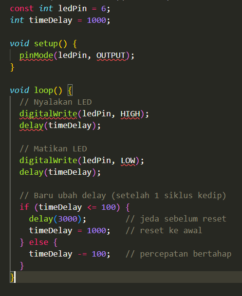
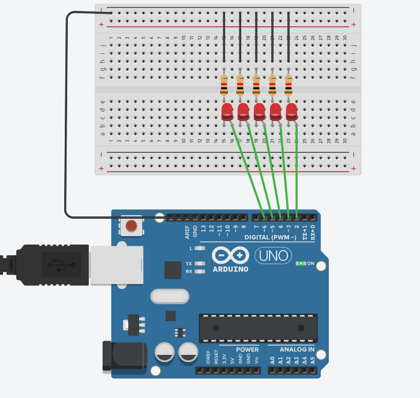
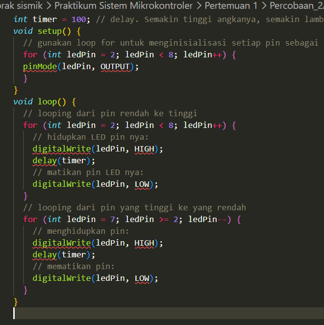

1.5 Pertanyaan Praktikum

1. Pada kondisi apa program masuk ke blok if? Program akan memasuki blok if ketika variabel timeDelay bernilai kurang dari atau sama dengan 100 (<= 100). Kondisi ini tercapai setelah durasi delay berkurang secara progresif dari 1000ms hingga mencapai batas minimum. Pada tahap ini, program akan melakukan reset sistem dengan memberikan jeda statis selama 3 detik sebelum mengembalikan timeDelay ke nilai awal (1000ms).

2. Pada kondisi apa program masuk ke blok else?  Blok else dieksekusi selama nilai timeDelay masih di atas 100. Di dalam blok ini, program menjalankan rutinitas pengurangan nilai variabel sebesar 100ms pada setiap akhir siklus kedip. Hal ini mengakibatkan frekuensi kedipan LED meningkat secara bertahap (semakin cepat) di setiap iterasinya.

3. Apa fungsi dari perintah delay(timeDelay)? Perintah delay(timeDelay) berfungsi sebagai blocking function yang menunda eksekusi instruksi selanjutnya selama durasi tertentu (dalam milidetik). Penggunaan dua instruksi delay dalam satu siklus memastikan LED memiliki durasi aktif (ON) dan non-aktif (OFF) yang simetris, sehingga menghasilkan ritme kedipan yang konsisten sesuai nilai variabel yang sedang berjalan.

4. Jika program yang dibuat memiliki alur mati → lambat → cepat → reset (mati), ubah menjadi LED tidak langsung reset → tetapi berubah dari cepat → sedang → mati dan berikan penjelasan disetiap baris kode nya dalam bentuk README.md!

1.6 Pertanyaan Praktikum

1. Schematic 5 LED Running

2. Bagaimana program membuat efek LED berjalan kiri ke kanan? Efek visual "berjalan" ke arah kanan dihasilkan melalui penggunaan struktur perulangan for yang menginkrementasi nomor pin (ledPin++) dari pin 2 menuju pin 7. Pada setiap iterasi, hanya satu LED yang diaktifkan (HIGH) kemudian dinonaktifkan (LOW) setelah jeda singkat, sehingga menciptakan ilusi optik pergerakan linier searah.

3. Bagaimana program membuat LED kembali dari kanan ke kiri? Untuk menghasilkan gerakan balik, program menggunakan struktur perulangan for kedua dengan logika dekrementasi (ledPin--). Program memulai aktivasi dari pin indeks tertinggi (pin 7) menuju pin terendah (pin 2), sehingga urutan nyala LED berpindah dari sisi kanan kembali ke sisi kiri secara berurutan.

4. Buatkan program agar LED menyala tiga LED kanan dan tiga LED kiri secara bergantian dan berikan penjelasan disetiap baris kode nya dalam bentuk README.md!

